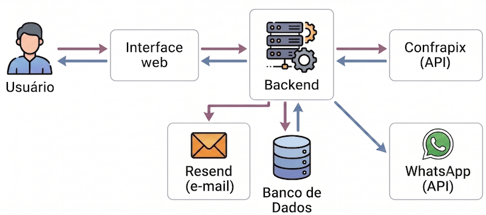

<!-- _paginate: false -->
<!-- _class: center-logo -->

---

# Visão

Oferecer um serviço simples e totalmente digital para recebimento e administração de pagamentos recorrentes.

---

# Problema

Uma pessoa deseja receber pagamentos recorrentes (diários, semanais, anuais ou datas e períodos específicos). Como enviar as solicitações de pagamento e administrar os pagamentos feitos de uma maneira simples e eficaz?

---

# Público alvo

Qualquer pessoa que necessite receber pagamentos recorrentes, como:

- Uma criança que precisa receber mensalmente a mesada dos pais, tios e avós;
- Um prestador de serviços que precisa receber semanalmente o dinheiro do transporte;
- Alguém deseja dar um presente de aniversário em dinheiro.

---

# Relevância do problema

Realizar pagamentos recorrentes é um problema bastante comum e existem poucos ou quase nenhum serviço que implemente o envio de
solicitações e administração destes pagamentos.

---

# Solução

**Kofrinho**: um serviço web que envia solicitações de pagamentos recorrentes por e-mail e WhatsApp e administra os pagamentos (não) realizados.

---

# Arquitetura

---

# Gateways

- **ConfraPix** para a criação (links) de pagamentos via pix;
- **Resend** para o envio dos e-mails;
- **WhatsApp** para o envio de mensagens.

---

<!-- _paginate: false -->
<!-- _class: center-logo -->
# Demonstração

---

# Desafios Encontrados

- Os testes precisaram ser feitos à mão, dificultando a criação de testes automatizados;
- Limitações na API da ConfraPag
  - Não permite a criação de novas contas totalmente via API;
  - Não permite a criação de "carteiras" virtuais em uma conta;
- Limitação na API do WhatsApp
  - Bem burocrática e limitante
  - Não permite de maneira fácil a criação de testes automatizados

---

# Próximos Passos

- Fazer uma administração 100% via troca de mensagens no WhatsApp

---

<!-- _paginate: false -->
<!-- _class: center-logo -->
# Perguntas e Comentários

---

<!-- _paginate: false -->
<!-- _class: center-logo -->
# Obrigado!
